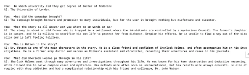

# AI-Powered Sherlock Holmes Query System

## Overview
This project allows users to query specific information from a collection of Sherlock Holmes stories using an AI-powered vector database. By combining LangChain, SingleStoreDB, and OpenAI embeddings, we have created a system where users can ask questions about the stories and retrieve relevant answers from the provided dataset.

The project uses the [Sherlock Holmes stories in plain text](https://sherlock-holm.es/stories/plain-text/stud.txt) as the document source, processes the data into manageable chunks, generates embeddings, and stores the embeddings in a SingleStore database for fast similarity searches.




## Technologies Used

- **LangChain**: For text processing and creating embeddings.
- **SingleStoreDB**: For storing the vector embeddings and providing efficient similarity search capabilities.
- **OpenAI Embeddings**: For generating vector representations of text.
- **Python**: The main programming language for implementing the system.
- **Requests**: For fetching the .txt file of the Sherlock Holmes stories.

## Features

- **Text Processing**: The Sherlock Holmes story text is processed and split into smaller chunks for better handling and embedding.
- **Embedding Generation**: OpenAI's Embedding API is used to generate vector embeddings for each text chunk.
- **Vector Database**: SingleStoreDB is used to store the embeddings and allow for fast, similarity-based searches.
- **Query System**: Users can input a question, and the system will find the most relevant text from the stories to answer that question.

## Installation

1. Clone the repository:

    ```bash
    git clone https://github.com/yourusername/sherlock-query-system.git
    cd sherlock-query-system
    ```

2. Install the required packages:

    ```bash
    pip install -r requirements.txt
    ```

3. Set up your OpenAI API key as an environment variable:

    ```bash
    export OPENAI_API_KEY="your_openai_api_key"
    ```

4. Make sure you have a running instance of **SingleStoreDB** (either locally or via cloud).

5. Set up the database using the provided scripts or instructions in the **SingleStoreDB Setup** section below.

## Usage

1. The system will automatically download the Sherlock Holmes stories from the provided URL (`https://sherlock-holm.es/stories/plain-text/stud.txt`) and save it as `downloaded_example.txt`.
   
2. The text is then split into chunks using the **CharacterTextSplitter** class from LangChain.

3. The embeddings are generated for each chunk using OpenAI's API and stored in the **SingleStoreDB**.

4. To query the system, simply run the query function with your question.

    Example:

    ```python
    query = "Which university did Sherlock Holmes study at?"
    result = vector_database.similarity_search(query)
    print(result[0].page_content)
    ```

## SingleStoreDB Setup

Ensure you have set up your **SingleStoreDB** instance and created a table to store the embeddings. The code will use this table to store the generated embeddings. 

Here’s an example schema for the table:

```sql
CREATE TABLE scarlet (
    id INT AUTO_INCREMENT PRIMARY KEY,
    content TEXT,
    embedding VECTOR
);


